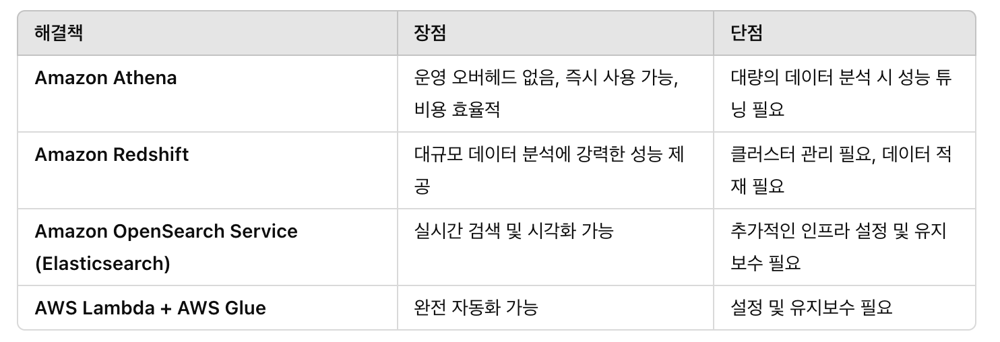

## Q1.
### 요구 사항
* 여러 대륙에 걸쳐 데이터를 수집하는 사이트들
* 고속 인터넷 연결되어 있음.
* **단일** Amazon S3 버킷에 집계
* 최대한 빨리, 운영 복잡성 최소화

### 설명

✅ S3 Transfer Acceleration

 * S3에 장거리 데이터를 빠르게 업로드 하기 위한 기능
 * 사용자가 요청 위치에서 가장 가까운 `엣지 로케이션`을 통해 데이터가 전송되고
 * 엣지 로케이션에서 `aws의 내부 네트워크를 통해  S3에` 업로드 된다.

## Q2.
### 요구 사항
* S3에 저장된 로그 파일 쿼리
* 로그는 JSON 형식
* 기존 아키텍처에 대한 최소한의 변경

### 설명
✅ Amazon Athena

* S3에 표준 SQL로 쿼리할 수 있음
* 서버리스 방식, 온디멘드 요금

## Q3.
### 요구 사항
* AWS Organizations를 사용하여 계정을 관리
* 특정 S3 버킷에 대한 액세스를 조직 내 계정으로만 제한
* 최소한의 운영 오버헤드

### 설명

✅ aws:PrincipalOrgID  

리소스 관련 정책에서 권한을 확인할 때 접근가능한 ID를 전부 나열하지 않고, organization ID만으로 설정할 수 있음.

✅ 조건 키를 S3 버킷 정책에 추가

해당 조건에 속한 IAM만 리소스에 액세스 할 수 있음.

## Q4.
### 요구 사항
* EC2에서 S3로 **인터넷 연결 없이** 액세스
* EC2는 VPC에 있음.

### 설명
✅ Gateway VPC Endpoint란?

* 인터넷이나 NAT 게이트웨이 없이 AWS 내부 네트워크를 통해 S3에 직접 접근 가능.
* 트래픽이 AWS 네트워크 내부에서만 이동하므로 보안성이 뛰어나고 비용 절감 효과가 있음.
* VPC 내에서 프라이빗 서브넷에 있는 EC2 인스턴스도 인터넷 연결 없이 S3에 접근 가능.

## Q5.
### 요구 사항
* 단일 EC2에서 EBS볼륨을 사용하여 문서를 저장.
* 다른 가용 영역에 아키텍처를 그대로 복사하고 Load Balancer를 두었음.
* 이후 문서의 일부만 볼 수 있는 문제 발생

### 설명
✅ EBS, EFS 차이
* EBS는 단일 AZ에서만 접근 가능, EFS는 여러 AZ에서 접근 가능
* 일반 EBS는 단일 EC2 인스턴스에만 부착 가능(Multi-Attach기능은 io1/io2 볼륨에서 사용 가능)
* EFS는 여러 서버에서 접근 가능

## Q6.
### 요구 사항
* 온프레미스 스토리지에 파일 저장 중. 최대 70TB
* S3로 마이그레이션 필요
* **최소한의 네트워크 대역폭**을 사용, 가능한 빨리

### 설명

✅ 사진 한장으로 설명하는 AWS Snowball

## Q7.
### 요구 사항
* 여러 어플리케이션에서 메시지를 ㅂ소비
* 메시지 수는 급격하게 변하며 초당 100,000 개로 급증하기도 함.
* 솔루션을 분리하고 확장성을 높이는 방법

### 설명
✅ Amazon SNS (Simple Notification Service)

* 발행/구독(Pub/Sub) 모델을 사용하여 여러 애플리케이션이 동시에 메시지를 받을 수 있도록 함.
*  비동기적으로 메시지를 브로드캐스트하여 빠른 확장성을 지원.

✅ Amazon SQS (Simple Queue Service)

* 여러 개의 SQS 큐를 SNS에 구독(Subscribe)하도록 설정하면, 메시지가 각 큐에 개별적으로 전달됨.
*  자동 스케일링 가능, 여러 애플리케이션이 각자의 속도로 메시지를 처리할 수 있음.
*  소비자(Consumer) 애플리케이션이 각자의 큐에서 개별적으로 메시지를 처리하므로, 병목 현상을 방지하고 확장성을 극대화할 수 있음.

SNS는 메시지를 브로드캐스트하고, SQS를 사용하여 각 애플리케이션이 독립적으로 메시지를 처리할 수 있도록 하여 디커플링과 확장성을 제공한다

## Q8.
### 요구 사항
* 분산 어플리케이션을 AWS로 마이그레이션
* 기본 서버에서 여러 컴퓨텅 노드의 작업을 조정하고 있음
* 탄력성과 확장성을 극대화하도록 변경

### 설명
* 레거시의 경우 기본 서버에서 여러 컴퓨팅 노드의 작업을 조정하기 때문에 의존성이 존재함.
* SQS를 통해 여러 노드의 의존성을 분리할 수 있음 (확장성)
* EC2의 오토 스케일링을 큐의 사이즈에 따라 조정 (탄력성)

## Q9.
### 요구 사항
* 데이터 센터에서 파일 서버 실행 중
* 파일 생성 이후 7일이 지나면 거의 액세스하지 않음.

### 설명
Amazon S3 File Gateway
* 온프레미스 애플리케이션이 S3 스토리지를 사용할 수 있도록 하는 서비스
* 지정 기간이 지나면 S3 Standard 에서 S3 Glacier Deep Archive로 자동 전환하는 수명 주기 정책 지원

## Q10.
### 요구 사항
* 주문이 접수된 순서대로 처리

### 설명
* FIFO

## Q11.
### 요구 사항
* ec2 에서 db에 접근하는 자격 증명에 대한 운영 오버헤드 최소화 

### 설명
✅ AWS Secrets Manager

* 자격 증명(사용자 이름, 비밀번호)을 안전하게 저장하고 관리하는 서비스
* 자동으로 비밀번호를 변경(자동 회전, Rotation)할 수 있어 보안 강화

## Q12.
### 요구 사항
* 웹 애플리케이션
* 정적 컨텐츠 S3
* 동적 컨텐츠 ALB에 연결된 EC2
* 응답 시간 개선

### 설명
✅ CloudFront를 사용하여 정적 및 동적 콘텐츠 모두 캐싱하면:

* 전 세계 엣지 로케이션(Edge Location)을 활용하여 정적 콘텐츠(S3 데이터) 로딩 속도 개선
* ALB에서 제공하는 동적 콘텐츠도 CloudFront의 최적화된 경로를 사용하여 성능 향상
* Route 53을 사용하여 CloudFront로 트래픽을 라우팅하면 최적의 경로로 콘텐츠를 제공

✅ AWS Global Accelerator

* HTTP 요청이나 정적 컨테츠 보다 TCP/UDP 등에 더 적합

## Q14.
### 요구 사항
* 로드가 증가하면 데이터베이스의 성능이 빠르게 저하
* 쓰기 보다 읽기 요청이 더 많음
* 고가용성과 탄력성 충족하는 솔루션

### 설명
✅ Amazon Aurora (MySQL 호환)

* MySQL 8.0과 호환되며 기존 MySQL 애플리케이션과 쉽게 통합 가능.
* 고가용성(Multi-AZ) 지원 → 데이터 복제 및 장애 조치 자동화.
* Aurora Auto Scaling을 사용하면 읽기 부하 증가 시 자동으로 리더 노드(Aurora Replicas) 추가 가능.

## Q15.
### 요구 사항
* VPC 인바운드 / 아웃바운드 트래픽을 검사하고 필터링하는 솔루션 

### 설명
✅ AWS Network Firewall의 주요 기능:

* VPC의 네트워크 트래픽을 검사하고, 특정 규칙(Rules)을 적용하여 보안 정책을 적용 가능.
* 스테이트풀(Stateful) 및 스테이트리스(Stateless) 트래픽 필터링 제공.
* Suricata 기반의 Deep Packet Inspection (DPI) 지원 → 네트워크 보안 및 침입 탐지 가능.
* VPC 내부, 외부 트래픽을 보호할 수 있는 완전 관리형 네트워크 보안 솔루션.

